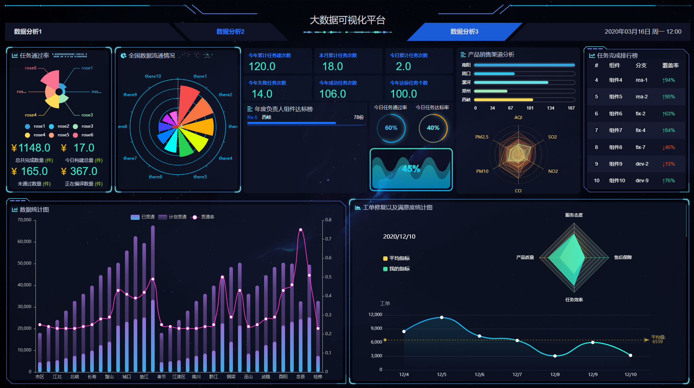

## 一、项目描述


>基于data-v 构建的大屏，如果对你有所帮助还希望你可以给个星


项目截图


## 二、主要文件介绍

| 文件                | 作用/功能                                           |
| ------------------- | --------------------------------------------------- |
| mian.js             | 主目录文件，全局引入了引入 vue-awesome              |
| views/ index.vue    | 项目主结构                                          |
| views/其余文件      | 界面各个区域组件（按照位置来命名）ajax 接口请求位置 |
| assets              | 静态资源目录，放置 logo 与背景图片                  |
| assets / style.scss | 通用 CSS 文件，全局项目快捷样式调节                 |
| assets / index.scss | Index 界面的 CSS 文件                               |
| components/echart   | 所有 echart 图表（按照位置来命名）                  |

## 技术实现点

布局采用datv—v 阿里技术


```html

<dv-full-screen-container>content</dv-full-screen-container>


```

图表采用chart

```js
import Charts from '@jiaminghi/charts'

const container = document.getElementById('container')

const myChart = new Charts(container)

```

更换边框

```html

<dv-border-box-1>dv-border-box-1</dv-border-box-1>

```


## 三、使用介绍

1. **如何请求数据**
   本项目没有采用mock，而是通过定时器跟换数据，有兴趣同学可以私下搭建mock


- 在 vue 页面中调用 axios 方法并通过 props 传给 echarts 图表子组件

```js
export default {
  data() {
  	ListDataSelf:[]
  },
  mounted() {
   this.fetchList(); //获取数据
  },
  methods: {
	async fetchList(){
	  const { code,listData }= await this.$http.get("xx/xx/xx"x);
	  if(code === 200){
		 this.ListDataSelf= listData;
	  }
	}
  }
 }
```

2. **如何动态渲染图表**
   在`components/echart`下的文件，比如`drawPie()`是渲染函数，`echartData`是需要动态渲染的数据，当外界通过`props`传入新数据，我们可以使用`watch()`方法去监听，一但数据变化就调用`this.drawPie()`并触发内部的`.setOption`函数，重新渲染一次图表。

```js
//这里是子组件内部

props: ["listData"],
watch: {
  listData(newValue) {
     this.echartData= newValue;
     this.drawPie();
   },
  },
methods: {
  drawPie() {
  	.....
  	'渲染节点名称'.setOption(option);
  }
 }
```

## 四、项目部署以及恢复


构建vueconfig.js

```js
module.exports = {
 
  publicPath:'./',
 
  outputDir: 'dist',
  
  assetsDir: "assets",
 
  productionSourceMap: false,
 
  filenameHashing: false,
  /* 代码保存时进行eslint检测 */
  lintOnSave: true,
  /* webpack-dev-server 相关配置 */
  devServer: {
    
      open: false,
  
      port: 9527,
      https: false,
      hotOnly: false,
      /* 使用代理 */
      proxy: {
          '/api': {
              /* 目标代理服务器地址 */
              target: 'http://47.100.47.3/',
              /* 允许跨域 */
              changeOrigin: true,
          },
      },
  },
}

```

路由配置如果是history

配置router 如下

```js
const router = new VueRouter({
  mode: "history",
  routes
})
```

反之

``` js
const router = new VueRouter({
  
  routes
})

```

## 更多代码关注薯条哥哥


